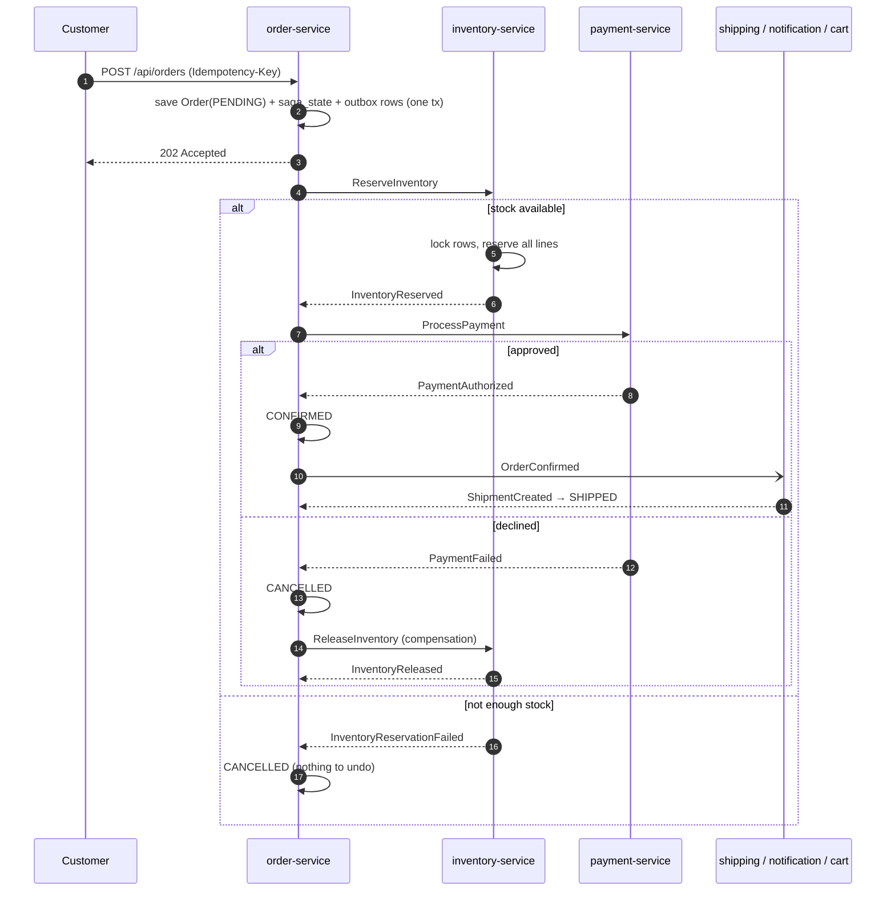

# Architecture

## System overview

```mermaid
flowchart TB
    web[Next.js frontend :3000] --> gw[API gateway :8080<br/>JWT, rate limit, circuit breakers]
    gw --> auth[auth-service<br/>Postgres]
    gw --> catalog[catalog-service<br/>MongoDB]
    gw --> cart[cart-service<br/>Redis]
    gw --> order[order-service<br/>Postgres, saga orchestrator]
    gw --> inventory[inventory-service<br/>Postgres]
    gw --> payment[payment-service<br/>Postgres]
    gw --> shipping[shipping-service<br/>Postgres]
    gw --> notification[notification-service<br/>Postgres + SMTP]
    gw --> search[search-service<br/>Elasticsearch]

    order -. "GET cart (checkout)" .-> cart
    cart -. "GET product" .-> catalog

    subgraph kafka[Kafka]
      direction LR
      t1[order.events]
      t2[inventory.commands / events]
      t3[payment.commands / events]
      t4[shipping.events]
      t5[catalog.events]
    end

    order <--> kafka
    inventory <--> kafka
    payment <--> kafka
    shipping <--> kafka
    notification <-- kafka
    search <-- kafka
    cart <-- kafka
    catalog --> kafka
```

Synchronous HTTP is used only for **queries** at request time (checkout reads the cart;
the cart reads product prices). Every **state change** that crosses a service boundary
travels as an event or command on Kafka.

## The order saga



**Timeouts.** `SagaTimeoutSweeper` runs every 15 s. A saga stuck on one step longer than
`order.saga.step-timeout` (2 min) is cancelled and compensated. If the payment reply
arrives *after* that, the orchestrator sends `RefundPayment`, so the customer is never
charged for a cancelled order. A stuck compensation (`RELEASING_INVENTORY`) is retried.

## Reliability patterns and where they live

| Problem | Pattern | Code |
|---|---|---|
| DB write succeeds, event lost (or vice versa) | Transactional outbox | `libs/common-messaging/.../OutboxWriter`, `OutboxRelay` |
| Kafka redelivers a message | Idempotent consumer | `IdempotentProcessor` + `processed_events` |
| Handler keeps failing | Retry with backoff, then dead-letter topic | `MessagingAutoConfiguration.kafkaErrorHandler` |
| Two buyers, one unit left | Pessimistic row locks + CHECK constraint | `StockRepository.lockAll`, `V1__create_stock.sql` |
| Double-click / retried checkout | Idempotency-Key, unique index | `CheckoutService`, `ux_orders_user_idempotency` |
| Charge twice for one order | UNIQUE(order_id) + provider idempotency key | `PaymentService`, `StripePaymentGateway` |
| Participant never answers | Saga timeout + compensation | `SagaTimeoutSweeper` |
| Late success after cancel | Refund compensation | `OrderSagaOrchestrator.onPaymentAuthorized` |
| Downstream outage cascades | Circuit breakers + timeouts at the gateway | `api-gateway/application.yml` |
| One client floods checkout | Redis token-bucket rate limiter | `RequestRateLimiter` on `/api/orders` |
| List queries hammer the write model | CQRS read model | `OrderHistoryProjection`, `order_history_view` |
| Out-of-order / duplicate replies | Saga step guard | `OrderSagaOrchestrator.expect(...)` |

## Security model

- The gateway is the only public entry point. It verifies the JWT (HS256, shared secret
  with auth-service) and forwards `X-User-Id`, `X-User-Email`, `X-User-Role`.
- It **strips** any client-supplied `X-User-*` headers first, so identity can't be spoofed.
- Services trust these headers, which is only safe because they aren't reachable from
  outside: in Kubernetes they're ClusterIP services; in production add a NetworkPolicy or
  mTLS (service mesh) so only the gateway can call them.
- Admin-only routes are enforced at the gateway (`AccessRules`).
- Payment methods are provider tokens, never card numbers.

## Observability

- **Traces**: Micrometer Tracing + OpenTelemetry → Jaeger. Trace context propagates
  through HTTP *and* Kafka headers (observation is enabled on the template and listeners).
  Because the outbox relay publishes from a background thread, each outbox row also stores
  the `traceparent` of the transaction that wrote it, and the relay restores it when
  publishing (`TracePropagation`). The result: one checkout is one trace across
  order → inventory → payment → shipping → notification.
- **Metrics**: `/actuator/prometheus` on every service. Business metrics:
  `orders_placed_total`, `orders_confirmed_total`, `orders_cancelled_total{reason}`,
  `order_saga_duration_seconds{outcome}`, `inventory_reservations_total{result}`,
  `payments_total{result}`, `outbox_pending`.
- **Logs** include trace and span ids, so a log line links to its trace.

## Data ownership

| Service | Store | Owns |
|---|---|---|
| auth | Postgres `auth_db` | users |
| catalog | MongoDB `catalog_db` | products |
| cart | Redis | carts (30-day sliding TTL) |
| order | Postgres `order_db` | orders, order_items, saga_state, order_history_view |
| inventory | Postgres `inventory_db` | stock, reservations |
| payment | Postgres `payment_db` | payments |
| shipping | Postgres `shipping_db` | shipments |
| notification | Postgres `notification_db` | notifications |
| search | Elasticsearch | products index (read model) |

## Next steps worth building

- Replace polling in the UI with Server-Sent Events from the gateway.
- Debezium CDC instead of the polling outbox relay.
- Avro + schema registry for event contracts.
- A real carrier simulation that advances shipments (in transit → delivered).
- Contract tests (Spring Cloud Contract or Pact) between the saga and its participants.
